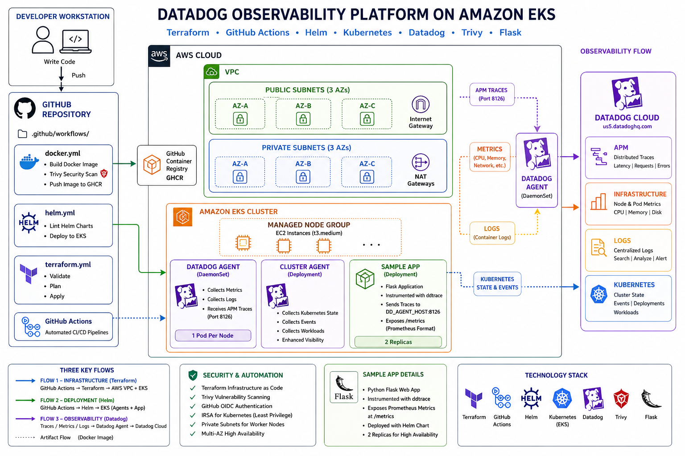

```markdown
# helm-observability-stack

Production-grade observability platform on AWS EKS — custom Helm charts written
from scratch, Datadog APM + metrics + logs, Terraform IaC, and GitHub Actions CI/CD.

## What this project demonstrates

| Skill | Evidence |
|---|---|
| Helm chart authoring from scratch | `charts/datadog-agent`, `charts/app-metrics` |
| Datadog observability (APM, logs, metrics) | `DatadogAgent` CR, ddtrace, Prometheus scraping |
| Terraform modules | `modules/vpc`, `modules/eks` |
| GitHub Actions CI/CD | `docker.yml`, `helm.yml`, `terraform.yml` |
| EKS best practices | IRSA, managed node groups, private subnets |

## Architecture



```
GitHub Actions
    ├── docker.yml ──► builds sample-app ──► GHCR
    ├── helm.yml ───► lints + deploys Helm charts ──► EKS
    └── terraform.yml ──► provisions AWS infrastructure

AWS
    ├── VPC (3 AZs, public/private subnets, NAT Gateways)
    └── EKS
          ├── datadog-agent (DaemonSet — metrics, logs, APM)
          └── app-metrics (sample Flask app with ddtrace)
```

## Repository Structure

```
├── terraform/
│   ├── modules/
│   │   ├── vpc/          # VPC, subnets, NAT gateways
│   │   └── eks/          # EKS cluster, node groups, IRSA
│   └── environments/
│       └── dev/          # Dev environment root config
├── charts/
│   ├── datadog-agent/    # Custom chart — DatadogAgent CR
│   └── app-metrics/      # Custom chart — sample app
├── apps/
│   └── sample-app/       # Flask app with Datadog APM
└── .github/
    └── workflows/        # CI/CD pipelines
```

## Stack

- **Kubernetes**: AWS EKS 1.30
- **Helm**: 3.15 (charts written from scratch)
- **Datadog**: Agent 7.52, APM, Log Collection, Cluster Agent
- **Terraform**: 1.8 (modular, environment pattern)
- **CI/CD**: GitHub Actions with OIDC (no static credentials)
- **App**: Python Flask + ddtrace + Prometheus metrics

## Author

DevOps/Cloud Engineer | AWS Solutions Architect Associate
```

## Live Demo

Real deployment to AWS EKS — screenshots taken from live Datadog dashboard.

### Host List — 2 EKS nodes reporting to Datadog


### Kubernetes Explorer — all 12 pods running


### Resource Utilization — live CPU graphs


### Live Monitoring — cluster metrics


### Container Images — detected by Datadog agent
